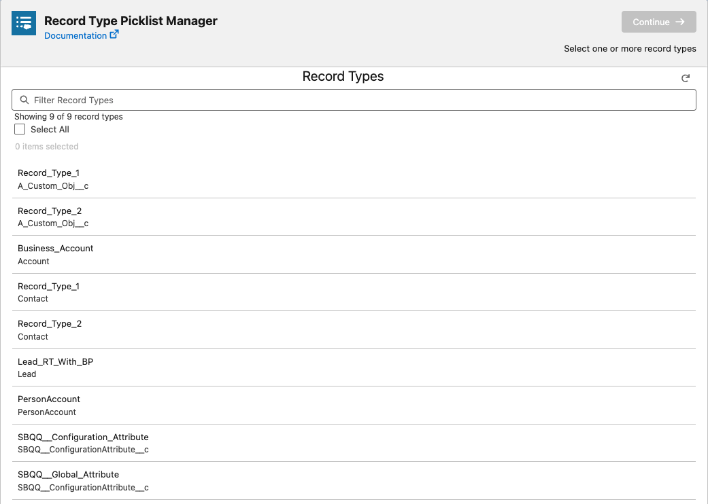
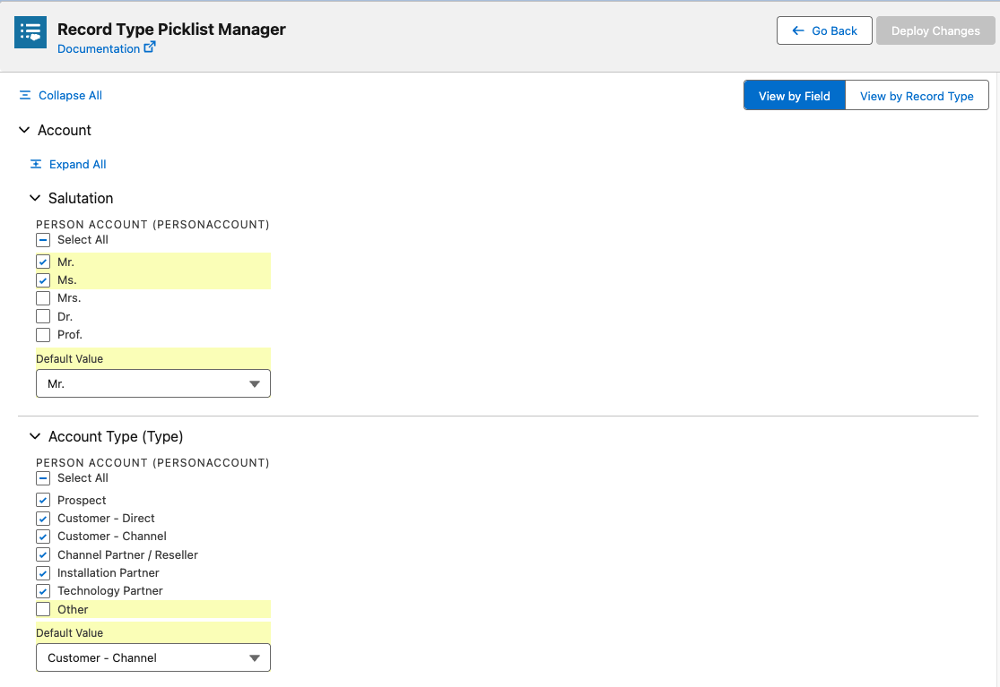
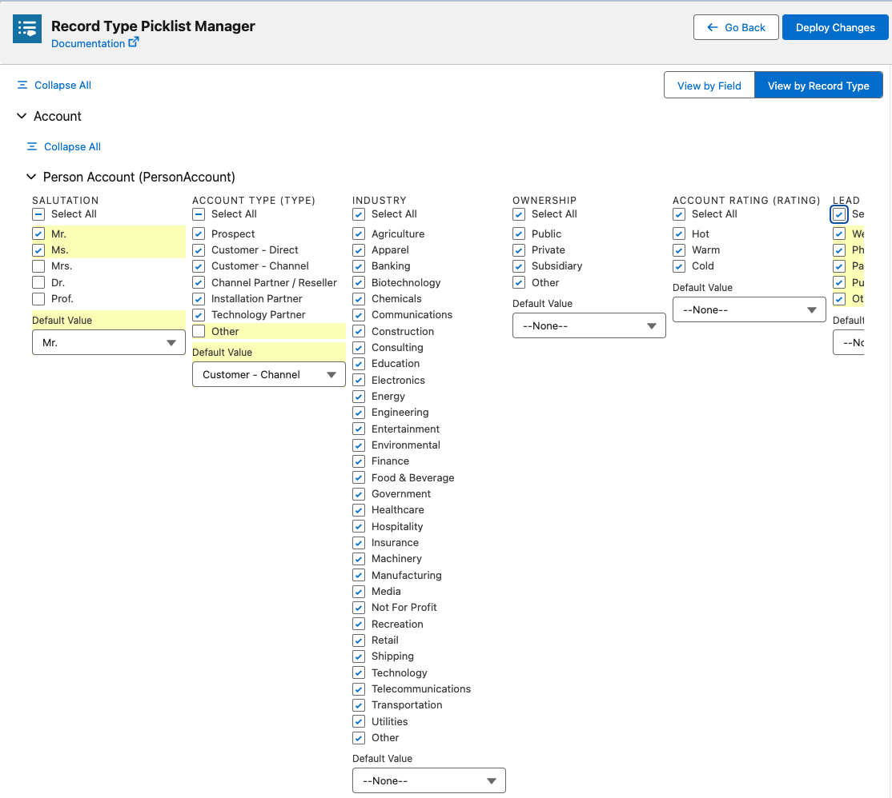
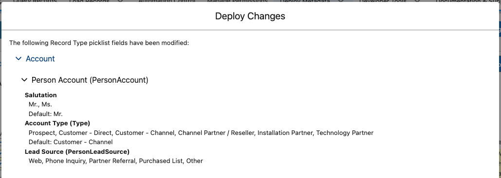

# Record Type Manager

The Record Type Manager in Jetstream allows you to efficiently configure and manage picklist values for record types in your Salesforce org.
This streamlines what is typically a time-consuming process through Salesforce's standard interface.

## Getting Started

When you first open the Record Type Manager, you'll be prompted to select the record types you want to configure.
You can select multiple record types at once to make bulk changes efficiently.

## Managing Picklist Values

After selecting your record types, you'll see the picklist configuration interface.
There are two different ways to view and manage your picklist values:

`View by Field` and `View by Record Type`

### View by Field

This view organizes picklist values by field, allowing you to see how each field is configured across multiple record types.

- Each field is displayed in an expandable accordion
- Within each field, you can see all available picklist values
- Toggle values on or off for each record type
- Easily compare configurations across multiple record types for the same field

### View by Record Type

This view organizes picklist values by record type, allowing you to focus on a specific record type's complete configuration.

- Each record type is displayed in an expandable accordion
- Within each record type, you can see all fields for the associated object
- Toggle picklist values on or off for each field
- Perfect for focusing on one record type's complete configuration

## Tracking Changes

As you make changes to picklist values:

- Modified values are highlighted in yellow to help you track what changes you've made
- A counter displays the number of changes you've made to help you keep track
- You can reset changes if needed before deploying

## Deploying Changes

Once you've made your desired configurations:

1. Click the "Deploy Changes" button
2. Review the summary of your changes in the deploy modal
3. Confirm the deployment to update your Salesforce org

## Benefits

- Save time by making bulk changes across multiple record types
- Visualize differences between record type configurations
- Easily track which changes you've made before deploying
- Deploy changes directly from the interface
- Avoid the multiple clicks and page loads required in Salesforce setup

## Best Practices

- Use "View by Field" when standardizing values across record types
- Use "View by Record Type" when focusing on a specific record type's configuration
- Review the change summary carefully before deploying to avoid unintended changes
