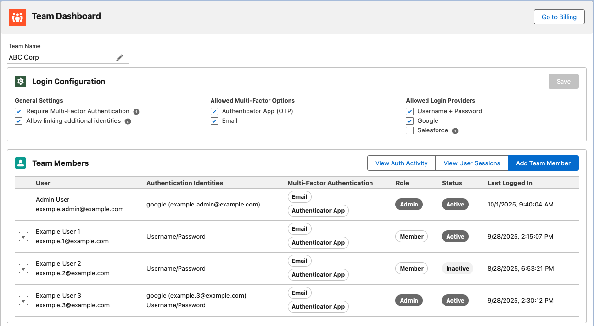
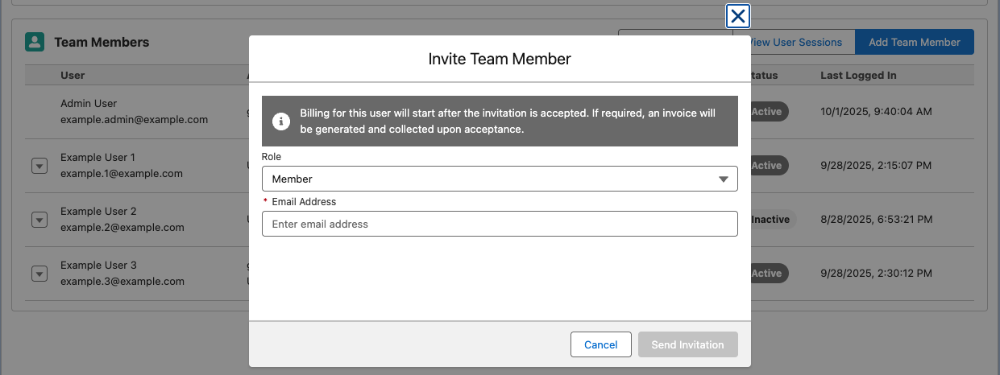
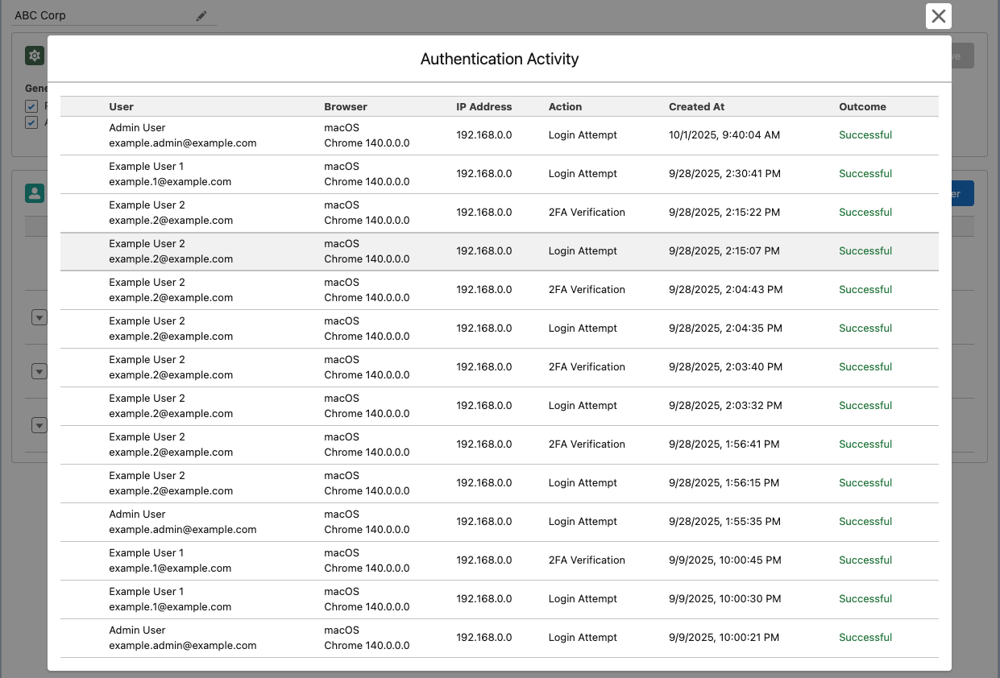
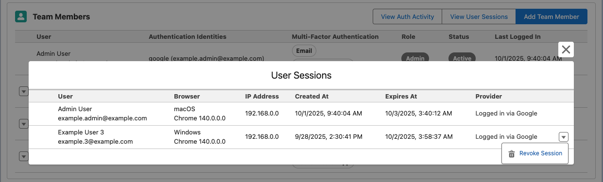

:::info

This feature is available on our Team and Enterprise plans. [Learn more about our plans and pricing](https://getjetstream.app/pricing/).

:::

The Team Dashboard is your central hub for managing team members, configuring login security settings, and monitoring team activity. Access the Team Dashboard by navigating to **Settings > Team Dashboard**.

## Overview

The Team Dashboard provides:

- **Team name management**: Customize your team's display name
- **Login configuration**: Control authentication methods and security requirements
- **Team member management**: Invite, activate, deactivate, and manage team member roles
- **Activity monitoring**: View authentication activity and active user sessions (Admin only)

## Team Name

Click the edit icon next to your team name to update it. The team name is displayed throughout the application and helps identify your organization.

## Login Configuration

Configure how team members authenticate and what security requirements they must meet. Changes to login configuration affect all team members on their next login.

### General Settings

#### Require Multi-Factor Authentication

When enabled, all team members must set up Multi-Factor Authentication (MFA) before they can log in. Users without MFA will be prompted to configure it on their next login attempt.

:::tip
Requiring MFA significantly improves your team's security posture by adding a second layer of authentication beyond passwords.
:::

#### Allow linking additional identities

When enabled, team members can link multiple authentication providers (e.g., Google, Salesforce) to their account. This allows users to log in using any of their linked identities.

:::tip
Disabling this option restricts users to a single authentication method, which enhances security but may reduce convenience.
:::

### Allowed Multi-Factor Options

Control which MFA methods team members can use:

- **Authenticator App (OTP)**: Time-based one-time passwords using apps like Google Authenticator, Authy, or 1Password
- **Email**: Verification codes sent via email

:::info
At least one MFA method must be enabled.
:::

### Allowed Login Providers

Control which authentication methods team members can use to log in:

- **Username + Password**: Traditional email and password authentication
- **Google**: Single sign-on using Google accounts
- **Salesforce**: Single sign-on using Salesforce production environments

:::info
At least one login provider must be enabled.
:::

:::note Salesforce Login
Login with Salesforce requires using a production environment. The connected app name is "Jetstream Auth" and may require installation after the first login attempt. [Learn more about installing the connected app](/docs/getting-started/install-connected-app).
:::

### Saving Changes

After making changes to the login configuration, click the **Save** button in the top-right corner of the Login Configuration card. Modified fields will be highlighted in yellow to indicate unsaved changes.

## Team Members

The Team Members table displays all active members, inactive members, and pending invitations.

### Team Member Information

For each team member, you can view:

- **User**: Name and email address
- **Authentication Identities**: Login methods linked to the account (e.g., Google, Username/Password)
- **Multi-Factor Authentication**: Configured MFA methods (e.g., Email, Authenticator App)
- **Role**: Member role (Admin, Member, or Billing)
- **Status**: Active or Inactive
- **Last Logged In**: Timestamp of most recent login

### Team Roles

- **Admin**: Full access to manage team settings, members, and billing
- **Member**: Standard user access to Jetstream features
- **Billing**: Access only to billing management (does not consume a license)

### Managing Team Members

#### Adding Team Members

1. Click the **Add Team Member** button
2. Select the role for the new member
3. Enter the email address
4. Click **Send Invitation**

:::info Billing
Billing for the new user starts after they accept the invitation. Depending on your plan, an invoice may be generated upon acceptance.
:::

The invited user will receive an email with instructions to accept the invitation and create or link their account.

#### Editing Team Members

Click the dropdown menu next to a team member to edit their role. Role changes take effect immediately.

#### Deactivating Team Members

Deactivating a team member:

- Revokes all active sessions immediately
- Prevents the user from logging in
- Stops billing for that user (except for Billing role users)
- May generate a credit for future invoices (depending on your plan)

To deactivate a member:

1. Click the dropdown menu next to the team member
2. Select **Deactivate**
3. Confirm the action

#### Reactivating Team Members

Reactivating a team member:

- Restores their access to Jetstream
- Resumes billing for that user
- May result in additional charges depending on your plan and current user count

To reactivate a member:

1. Click the dropdown menu next to the inactive team member
2. Select **Reactivate**
3. Confirm the action

### Managing Invitations

Pending invitations are displayed in the Team Members table with a "Pending" status.

For pending invitations, you can:

- **Resend Invite**: Send another invitation email
- **Cancel Invite**: Revoke the invitation

:::tip License Management
If you've reached your license limit, you must deactivate existing users or cancel pending invitations before adding new team members. Alternatively, contact support to purchase additional licenses.
:::

## Activity Monitoring

_Available to Admins only_

### View Authentication Activity

Monitor login attempts and authentication events for your team.

Click **View Auth Activity** to see:

- User login attempts
- 2FA verification events
- Timestamps and IP addresses
- Success/failure status
- Browser and device information

This information helps you:

- Detect suspicious login attempts
- Verify user access patterns
- Troubleshoot authentication issues

### View User Sessions

Monitor active user sessions across your team.

Click **View User Sessions** to see:

- Currently logged-in users
- Session creation and expiration times
- Browser and device information
- IP addresses
- Authentication provider used

Admins can revoke individual sessions by clicking the dropdown menu next to a session and selecting **Revoke Session**. This immediately logs the user out from that device.

:::tip Security Best Practice
Regularly review active sessions to ensure only authorized users have access. Revoke any suspicious or unrecognized sessions immediately.
:::

## Billing Integration

Access your team's billing information by clicking **Go to Billing** in the top-right corner of the Team Dashboard. This takes you to the [Billing page](/docs/user-profile-and-settings/billing) where you can:

- View and manage subscriptions
- Update payment methods
- Review invoices
- Purchase additional licenses

:::warning Past Due Notice
If your team has a past-due invoice, a warning will appear at the top of the Team Dashboard. Your team will be cancelled if service is not resumed. Visit the billing page or contact support for assistance.
:::

## Frequently Asked Questions

### How many team members can I add?

Our Team plan allows you to add up to 20 team members, while the Enterprise plan supports larger teams with custom limits.

If you are billed using a purchase order, please contact support to increase your license count. Otherwise your license count will be based on the number of users that are active and will be prorated as you add and remove users.

Billing role users do not consume a license.

### What happens when I reach my license limit?

When all licenses are in use, you must deactivate existing users, cancel pending invitations, or purchase additional licenses before adding new team members.

### Can I have multiple admins?

Yes, you can assign the Admin role to multiple team members. This allows shared responsibility for team management.

### How quickly do login configuration changes take effect?

Login configuration changes take effect on the next login attempt. If existing user sessions do not comply with the new configuration, they will be revoked and the user must login again.

The user making the changes is not affected until their next login.

### What happens to deactivated users' data?

Deactivated users' data is preserved. When reactivated, they regain access to their previous work, Salesforce connections, and saved queries.

If you would like to delete a user and their data permanently, contact support.

### Can I see who invited a team member?

The invitation details are tracked in your team's records. Contact support if you need this information.
